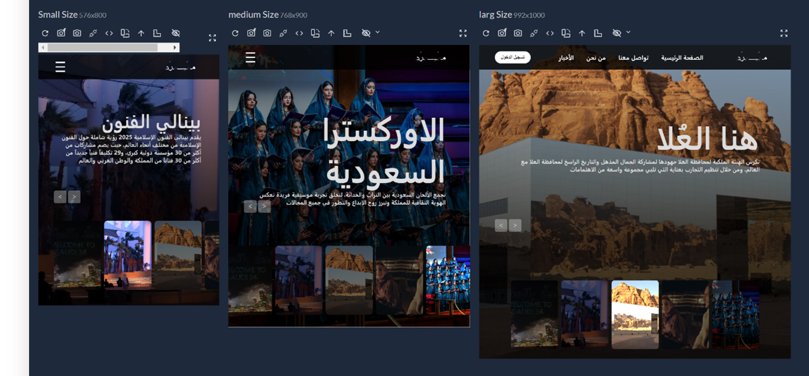
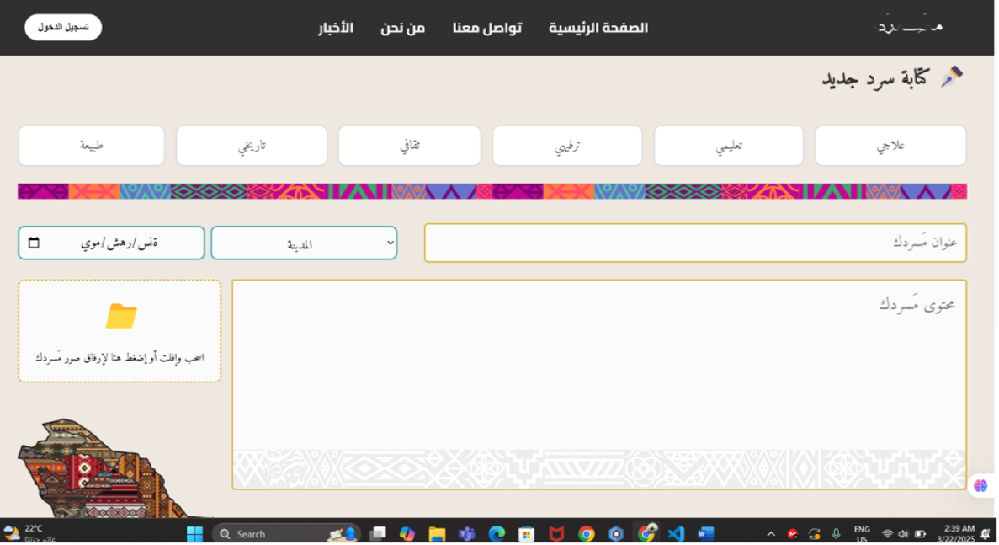
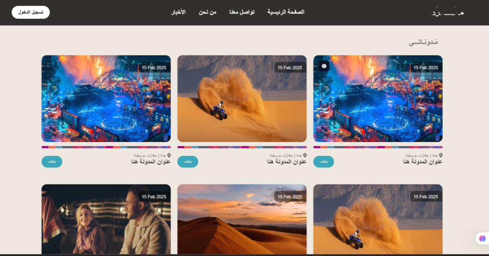
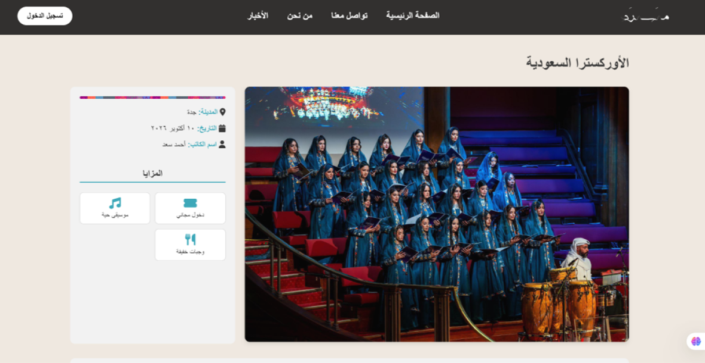

# Masrad | مسرد

### Preserving Stories, Experiences, and Saudi Heritage

 

## Overview

Masrad is a community-driven web platform dedicated to documenting and sharing stories, experiences, and knowledge about Saudi Arabia's cities, landmarks, and cultural destinations.

The platform encourages users to contribute content and build a collective archive that promotes local tourism, heritage, and cultural awareness.

---

## Visual Overview

---

## Features

- Explore Saudi cities and landmarks
- Discover local events and destinations
- Create and publish community content
- Delete and manage personal posts
- User-generated archive of experiences
- Community-driven destination discovery

---

## Tech Stack

### Frontend

  
  

### Backend

  

### Database

  

---

## Impact

Masrad helps preserve local stories and experiences while encouraging exploration of Saudi Arabia's cultural and historical destinations through community participation.
